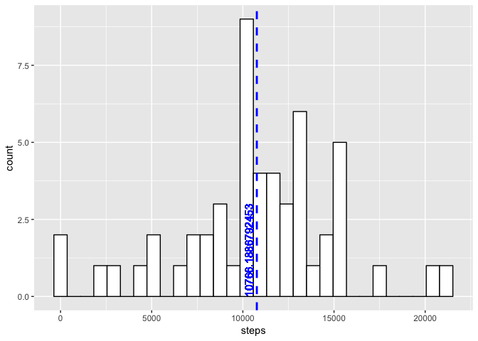
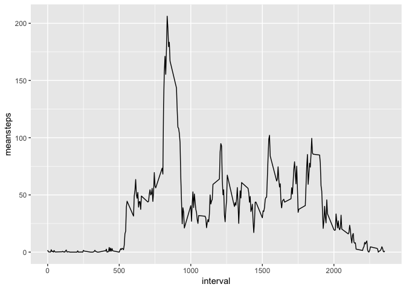
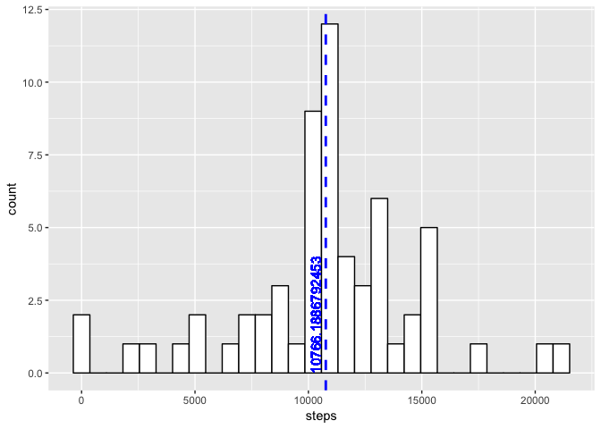
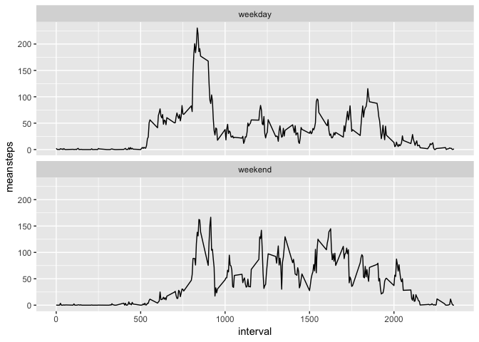

#Introduction

This report is for the purpose of collecting the moving data from monitoring devices. It is now possible to collect a large amount of data about personal movement using activity monitoring devices such as a Fitbit, Nike Fuelband, or Jawbone Up. These type of devices are part of the “quantified self” movement – a group of enthusiasts who take measurements about themselves regularly to improve their health, to find patterns in their behavior, or because they are tech geeks. But these data remain under-utilized both because the raw data are hard to obtain and there is a lack of statistical methods and software for processing and interpreting the data.

This assignment makes use of data from a personal activity monitoring device. This device collects data at 5 minute intervals through out the day. The data consists of two months of data from an anonymous individual collected during the months of October and November, 2012 and include the number of steps taken in 5 minute intervals each day.

#Data set resources:

The data for this assignment can be downloaded from the course web site:

Dataset: Activity monitoring data [52K] https://d396qusza40orc.cloudfront.net/repdata%2Fdata%2Factivity.zip
The variables included in this dataset are:

*steps: Number of steps taking in a 5-minute interval (missing values are coded as \color{red}{\verb|NA|}NA)

*date: The date on which the measurement was taken in YYYY-MM-DD format

*interval: Identifier for the 5-minute interval in which measurement was taken

The dataset is stored in a comma-separated-value (CSV) file and there are a total of 17,568 observations in this dataset.


## Loading and preprocessing the data

First we download the data and store the data into the memory.


```r
data_url <- "https://d396qusza40orc.cloudfront.net/repdata%2Fdata%2Factivity.zip"

if(!file.exists("repdata_data_activity.zip")){
        download.file(data_url, "repdata_data_activity.zip", method = "curl")
}

if(!file.exists("activity.csv")){
        unzip("repdata_data_activity.zip")
}

activity <- read.csv("activity.csv", sep = ",", header = TRUE, na.strings = NA)

library(lubridate)
activity$date <- ymd(activity$date)
```

## What is mean total number of steps taken per day?
To figure the mean total number of steps, we need to know the total number of steps in each day. I made a histogram showing the number of steps with counts. 


```r
library(dplyr)
library(ggplot2)
daily <- activity %>%
                group_by(date) %>%
                summarise(steps = sum(steps))

summarise(daily, meam_tot =  mean(steps, na.rm = TRUE),
                median_tot = median(steps, na.rm = TRUE))
```

```
## # A tibble: 1 x 2
##   meam_tot median_tot
##      <dbl>      <int>
## 1   10766.      10765
```

```r
ggplot(daily, aes(x = steps)) +
        geom_histogram(color = "black", fill = "white") +
        geom_vline(aes(xintercept = mean(steps, na.rm = TRUE)),
                   color = "blue", linetype = "dashed", size = 1) +
        geom_text(aes(x = mean(steps, na.rm = TRUE), y = 0, label = mean(steps, na.rm = TRUE)), size = 4, color = "blue", angle = 90, vjust = -0.5, hjust = 0)
```

<!-- -->

The blue dashed line in the histogram presents the mean number of steps.

## What is the average daily activity pattern?

The average daily activity pattern could be illustrated by the time series plot. The x-axis would be the 5-minutes interval. The y-axis would be the average number of steps group by each 5-minutes interval.


```r
meanact <- activity %>%
        group_by(interval) %>%
        summarise(meansteps = mean(steps, na.rm = TRUE))

ggplot(meanact, aes(x = interval, y = meansteps)) +
        geom_line()
```

<!-- -->

## Imputing missing values
To impute the NA values in the activity table, we can replace the missing values with the meansteps at the same interval where we calculated in the last question.

1. find out the number of rows that have missing values in the activity table.

```r
sum(is.na(activity$steps))
```

```
## [1] 2304
```

2. replace the missing values of the actvity table with the meansteps at the same interval in the table meanact.

```r
act <- activity %>% 
        group_by(interval) %>%
        mutate(meansteps = mean(steps, na.rm = TRUE))
act2 <- act
act2$steps[which(is.na(act$steps))] <- act$meansteps[which(is.na(act$steps))]
act2 <- select(act2, steps, date, interval)

head(act2)
```

```
## # A tibble: 6 x 3
## # Groups:   interval [6]
##    steps date       interval
##    <dbl> <date>        <int>
## 1 1.72   2012-10-01        0
## 2 0.340  2012-10-01        5
## 3 0.132  2012-10-01       10
## 4 0.151  2012-10-01       15
## 5 0.0755 2012-10-01       20
## 6 2.09   2012-10-01       25
```

3. make a histogram of the total number of steps taken each day. Calculate the mean and median total number of steps taken per day.

```r
daily2 <- act2 %>%
                group_by(date) %>%
                summarise(steps = sum(steps))
summarise(daily2, meam_tot =  mean(steps, na.rm = TRUE),
                median_tot = median(steps, na.rm = TRUE))
```

```
## # A tibble: 1 x 2
##   meam_tot median_tot
##      <dbl>      <dbl>
## 1   10766.     10766.
```

```r
ggplot(daily2, aes(x = steps)) +
        geom_histogram(color = "black", fill = "white") +
        geom_vline(aes(xintercept = mean(steps, na.rm = TRUE)),
                   color = "blue", linetype = "dashed", size = 1) +
        geom_text(aes(x = mean(steps, na.rm = TRUE), y = 0, label = mean(steps, na.rm = TRUE)), size = 4, color = "blue", angle = 90, vjust = -0.5, hjust = 0)
```

<!-- -->

The mean number of steps does not change, while the median number of steps slightly changes.

## Are there differences in activity patterns between weekdays and weekends?
The pattern should be differentiated by whether its weekday or not.


```r
act3 <- act2 
act3$weekday <-ifelse(weekdays(activity$date) %in% c("Saturday", "Sunday"), "weekend", "weekday")
head(act3)
```

```
## # A tibble: 6 x 4
## # Groups:   interval [6]
##    steps date       interval weekday
##    <dbl> <date>        <int> <chr>  
## 1 1.72   2012-10-01        0 weekday
## 2 0.340  2012-10-01        5 weekday
## 3 0.132  2012-10-01       10 weekday
## 4 0.151  2012-10-01       15 weekday
## 5 0.0755 2012-10-01       20 weekday
## 6 2.09   2012-10-01       25 weekday
```


Then we plot time-series plot of the 5-minutes intervals and the average number of steps taken, facet by weekday or weekend.


```r
meanact3 <- act3 %>%
        group_by(interval, weekday) %>%
        summarise(meansteps = mean(steps, na.rm = TRUE))

ggplot(meanact3, aes(x = interval, y = meansteps)) +
        geom_line() +
        facet_wrap(~weekday, nrow = 2)
```

<!-- -->
